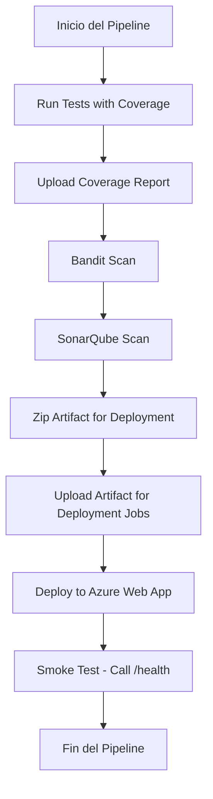

# QA-Example

[](https://sonarcloud.io/summary/new_code?id=ssanga_QA-example)
[](https://sonarcloud.io/summary/new_code?id=ssanga_QA-example)

## Introducción 2

Este proyecto es un ejemplo completo de integración continua y despliegue para una API REST desarrollada con FastAPI. Incluye:
- Cobertura de tests unitarios con pytest y pytest-cov
- Análisis de calidad y cobertura de código con SonarQube/SonarCloud
- Escaneo de seguridad con Bandit
- Despliegue automático en Azure App Service
- Ejemplo de configuración de pipelines CI/CD en GitHub Actions
- Smoke test del endpoint `/health` para verificar el despliegue

## URLs del proyecto

- **Web desplegada en Azure:** [https://qa-example-fqhxccfwepagbhdb.northeurope-01.azurewebsites.net](https://qa-example-fqhxccfwepagbhdb.northeurope-01.azurewebsites.net)
- **SonarQube/SonarCloud:** [https://sonarcloud.io/summary/new_code?id=ssanga_QA-example](https://sonarcloud.io/summary/new_code?id=ssanga_QA-example)

## Librerías requeridas

- fastapi
- uvicorn
- httpx
- pytest
- pytest-cov
- gunicorn
- bandit

Instala todas las dependencias con:

```
pip install -r requirements.txt
```

## Pruebas de seguridad con Bandit

El pipeline incluye un paso para escanear el código en busca de vulnerabilidades de seguridad usando Bandit. Bandit analiza los archivos Python y reporta posibles problemas de seguridad.  
Para ejecutar Bandit manualmente, usa:

```
bandit -r . -x venv,tests
```

## Smoke Test

Después del despliegue en Azure App Service, el pipeline realiza un smoke test llamando al endpoint `/health`. Este endpoint devuelve un JSON con el estado de la aplicación:

```
GET /health
Response: {"status": "ok"}
```

Este test asegura que la aplicación está funcionando correctamente después del despliegue.

## SonarQube y cobertura de tests en Python

Para más información sobre cómo integrar la cobertura de tests de Python en SonarQube, consulta la documentación oficial:  
[https://docs.sonarsource.com/sonarqube-cloud/enriching/test-coverage/python-test-coverage/](https://docs.sonarsource.com/sonarqube-cloud/enriching/test-coverage/python-test-coverage/)

### Diagrama del Pipeline CI/CD




